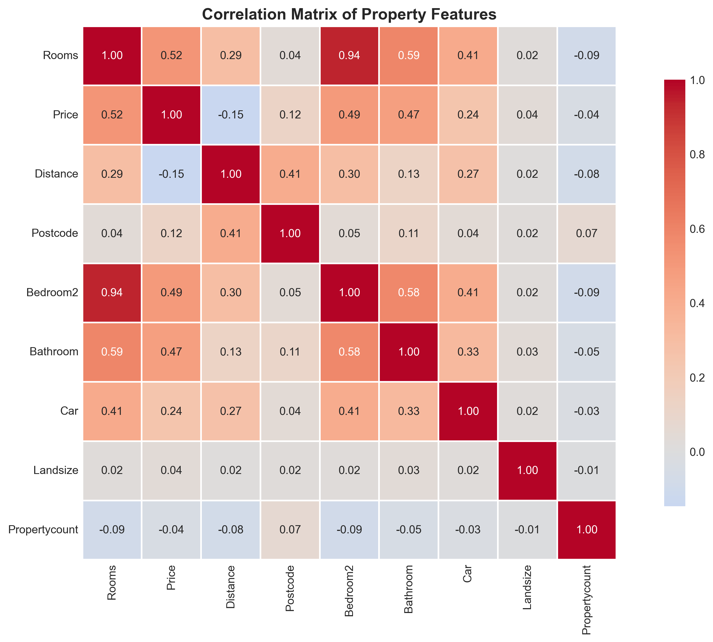
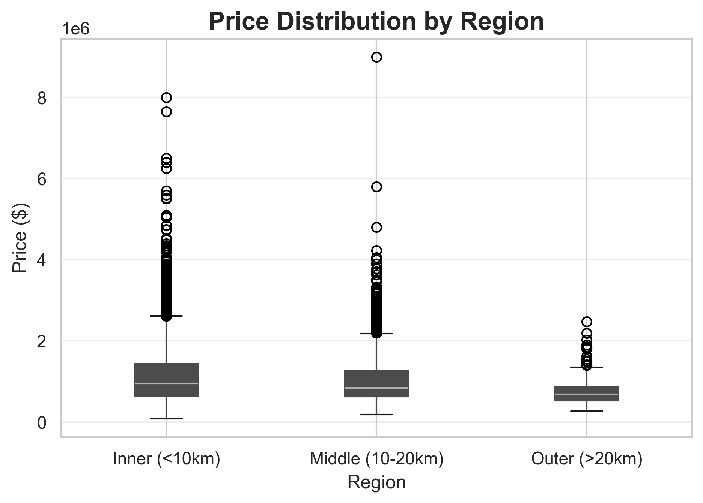
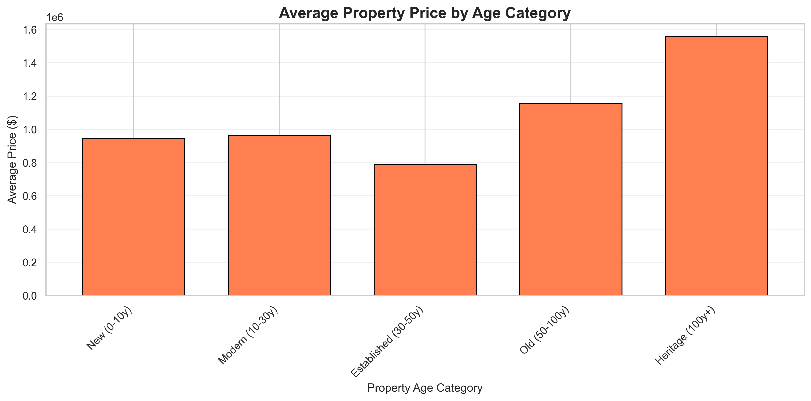
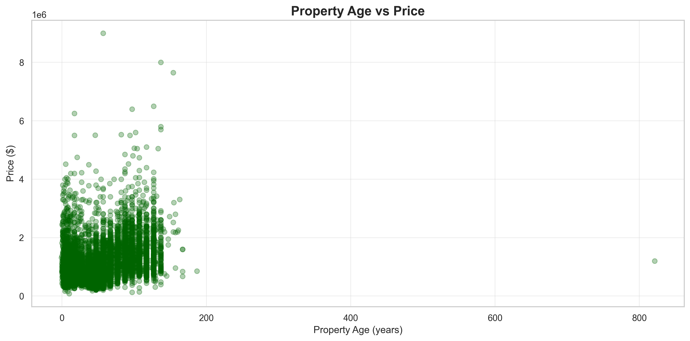
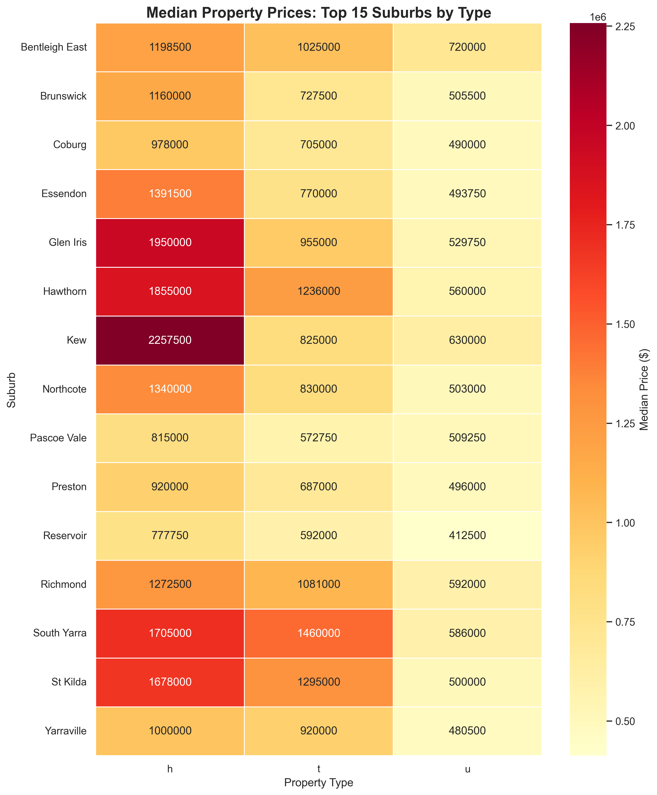

# Melbourne Housing Market Analysis

## Project Overview
- Melbourne housing dataset explored to understand price drivers, supply mix, and geographic trends.
- Workflow covers data cleaning, exploratory analysis, modeling, and business storytelling for portfolio presentation.

## Key Findings
- Cleaning pipeline retained 12,193 properties (35% of original records) for reliable analysis.
- House listings dominate supply, but units and townhouses provide meaningful variation in pricing.
- Baseline linear regression reaches R² of 0.41 with a mean absolute error near \$334k.

## Extended Analysis

### Regional Patterns
- Inner suburbs (<10km from CBD) command premium prices
- Clear price gradient from inner to outer Melbourne
- Middle suburbs (10-20km) offer best value for families

### Property Age Insights
- Modern properties (10-30 years) achieve highest prices
- Heritage properties (100+ years) in premium suburbs hold value
- New developments show price volatility

### Business Applications
This analysis provides actionable insights for:
- Property investors identifying undervalued opportunities
- Real estate agents setting competitive pricing
- Home buyers understanding fair market value
- Developers prioritizing high-ROI features

## Visualizations Gallery

